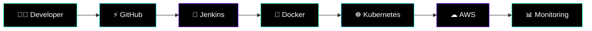

<!-- ========================================================= -->
<!--        ⚡ FUTURISTIC DEVOPS COMMAND CENTER ⚡             -->
<!-- ========================================================= -->

<p align="center">

</p>

---

<p align="center">


</p>

---

<p align="center">


</p>

---

<p align="center">

</p>

---

# ⚡ SYSTEM PROFILE


```yaml
name: Vinay Thallapelly

role: DevOps Engineer

specialization:
  - Kubernetes
  - Docker
  - CI/CD Automation
  - Cloud Infrastructure
  - Infrastructure as Code
  - Linux Administration

cloud:
  - AWS
  - Azure
  - GCP

currently_learning:
  - GitOps
  - ArgoCD
  - Platform Engineering
  - DevSecOps

mission:
  Building scalable cloud-native
  infrastructure with automation.
```

---

# ☁️ CLOUD PLATFORMS

<p align="center">


</p>

<p align="center">


</p>

---

# 🖥️ OPERATING SYSTEMS

<p align="center">


</p>

<p align="center">


</p>

---

# 🚀 DEVOPS & AUTOMATION

<p align="center">


</p>

<p align="center">


</p>

---

# ☸️ CONTAINERS & ORCHESTRATION

<p align="center">


</p>

<p align="center">


</p>

---

# 📊 MONITORING & OBSERVABILITY

<p align="center">


</p>

<p align="center">


</p>

---

# 🌐 WEB SERVERS

<p align="center">


</p>

<p align="center">


</p>

---

# ⚡ SCRIPTING & TOOLS

<p align="center">


</p>

<p align="center">


</p>

---

# 🗄️ DATABASES

<p align="center">


</p>

<p align="center">


</p>

---

# 🔐 DEVSECOPS & SECURITY

<p align="center">


</p>

<p align="center">


</p>

---

# 🧠 MODERN DEVOPS TOOLS 2026

<p align="center">


</p>

<p align="center">


</p>

---

# 🧠 DEVOPS EXECUTION FLOW



---

# 📊 GITHUB ANALYTICS

<p align="center">


</p>

---

<p align="center">


</p>

---

# ⚡ CONTRIBUTION MATRIX

<p align="center">

</p>

---

# 🏆 CERTIFICATIONS

<p align="center">


</p>

---

# 🌌 CURRENTLY LEARNING

<p align="center">


</p>

---

# 🌐 CONNECT WITH ME

<p align="center">

<a href="https://www.linkedin.com/in/thallapelly-vinay/">

</a>

<a href="https://www.instagram.com/vinny_lancer/">

</a>

<a href="mailto:thallapellyvinay007@gmail.com">

</a>

<a href="https://github.com/Vinay-T007">

</a>

</p>

---

<p align="center">

</p>
